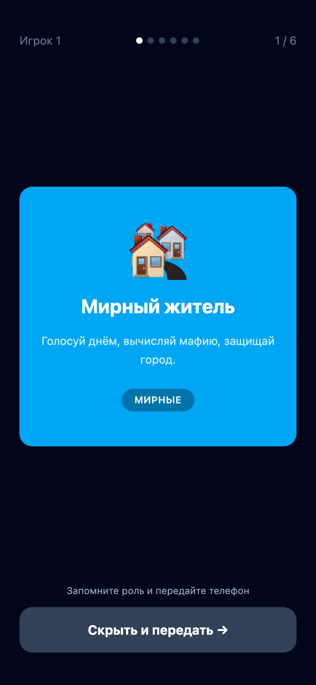

# Мафия

Веб-приложение для игры в Мафию без физических карточек. Один телефон передаётся по кругу — каждый игрок видит свою роль наедине.

**Живая версия:** https://mafia.dimonb.com

## Как играть

1. **Настройка** — выберите количество игроков и распределите роли
2. **Раздача** — телефон передаётся по очереди; каждый нажимает, чтобы увидеть свою роль, затем скрывает экран
3. **Игра** — ведущий отмечает выбывших; статистика обновляется в реальном времени

Настройки игроков и ролей сохраняются в этом браузере и остаются при обновлении страницы и начале новой игры. Разданные роли и ход партии не сохраняются.

При изменении числа игроков автоматически подбирается состав: около 30% мафии (Дон входит в это число с 7 игроков), один шериф, доктор с 6 игроков, остальные — мирные. После этого роли можно настроить вручную.

Во время раздачи все карточки используют одинаковую нейтральную палитру и значок, чтобы цвет не выдавал роль в отражении.

## Скриншоты

<table>
  <tr>
    <td align="center"><b>Настройка</b></td>
    <td align="center"><b>Раздача (замок)</b></td>
    <td align="center"><b>Карточка роли</b></td>
    <td align="center"><b>Игровое поле</b></td>
  </tr>
  <tr>
    <td></td>
    <td></td>
    <td></td>
    <td></td>
  </tr>
</table>

## Роли

| Роль | Фракция | Описание |
|------|---------|----------|
| 🏘️ Мирный житель | Мирные | Голосует днём, вычисляет мафию |
| 🔫 Мафия | Мафия | Ночью выбирает жертву вместе с командой |
| 👑 Дон Мафии | Мафия | Глава мафии; может проверить — шериф ли игрок |
| ⭐ Шериф | Мирные | Ночью проверяет одного игрока |
| 💊 Доктор | Мирные | Ночью лечит одного игрока (можно себя) |
| 🍀 Везунчик | Мирные | Мафия не может убить ночью |
| 🔪 Маньяк | Одиночка | Убивает сам; побеждает, оставшись последним |
| 💣 Суицидник | Одиночка | Побеждает, если город убивает его голосованием |
| 🐺 Оборотень | Мафия | Выглядит мирным; шериф видит как мирного |
| ⚖️ Адвокат | Мирные | Ночью блокирует способность одного игрока |

## Стек

- **React 19** + **TypeScript 6** + **Vite 8**
- **Tailwind CSS v4**
- Состояние через `useReducer` (state machine)
- Деплой: GitHub Pages (`dimonb/mafia`)

## Разработка

```bash
npm install
npm run dev
```

```bash
npm test
npm run build
```
